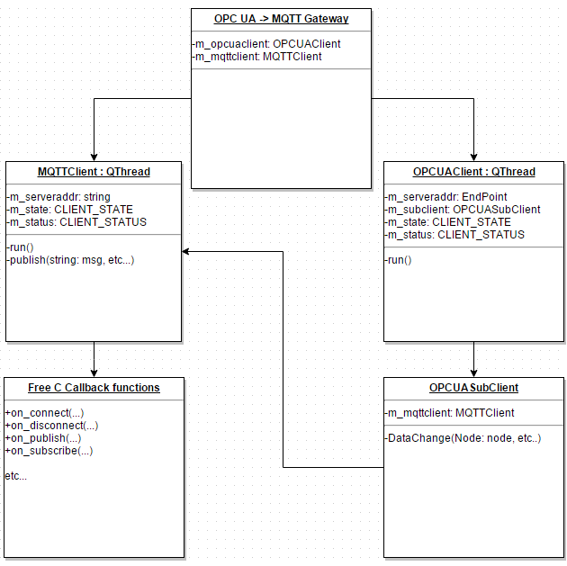
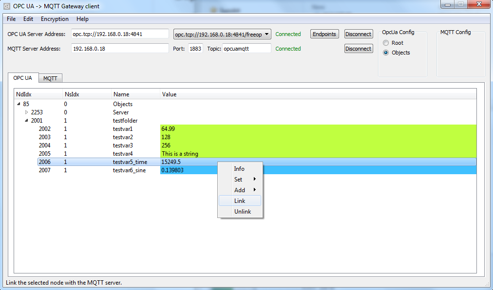

# OPC UA -> MQTT Gateway client

This client software is made for transferring OPC UA node value data to a target MQTT broker.

### Dependencies

- Compiler that supports C++11
- Qt 5.5
- FreeOpcUa library
  - Boost libraries
- Mosquitto library
  - C-Ares
  - PThread
  - OpenSSL

I personally used Qt 5.5 & MinGW32 4.9.2 while developing this and I only provide compiled library files for MinGW32 in this repository. Compiling & linking on linux shouldn't be an issue but you will probably struggle if you want to compile and link some of those libraries under Windows with MSVC.

### Repository structure

**client_qt_project**: This folder contains the source code of the client & Qt Creator project files.
**images**: Contains images related to the gateway client project.
**libraries**: This folder contains pre-compiled Windows library files for FreeOpcUa/Mosquitto & include headers.

### UML Diagram, clientside relations

_Very rough diagram showing the interaction between the MQTT & OPC UA client objects._

1. Subscription to node data change events is made on the OpcUa-side via client GUI.
2. Node value changes.
  * DataChange event function is executed in OPCUASubClient object,
  * Node value is transformed into a c-string (char *) & size of data is calculated.
  * MQTTClient::publish(...) is called, arguments passed are topic, node value and size in bytes.
3. Node value is published on the MQTT server.
  * Topic is "ChosenMainTopic/NodeNamespace/NodeBrowseName"
  * ChosenMainTopic can be changed via the client GUI.

### Screenshot of client GUI

_Screenshot of the Gateway client._

Screenshot showing the GUI of the client. Connected to a FreeOpcUa python server & a Mosquitto MQTT broker.